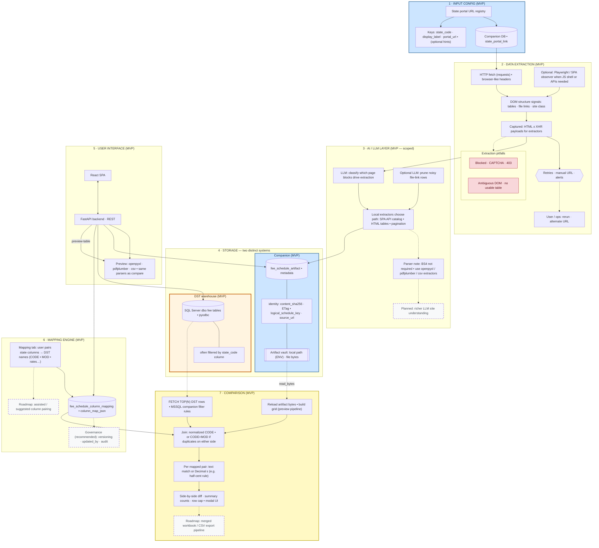

# Fee Schedule Tool — reference architecture (updated)

This redraws the conceptual flow with: **companion vs DST storage split**, **explicit join keys**, **honest MVP vs planned scope**, **failure / fallback paths**, and **stack labels aligned to the current codebase** (FastAPI, React, Playwright where used, `requests`, LLM calls for block/file relevance — **not** implying BeautifulSoup or a specific LLM unless you standardize on them).

**How to view / export:** paste the Mermaid block into [Mermaid Live Editor](https://mermaid.live) → export PNG/SVG.

---

## Legend

| Style        | Meaning                                                          |
| ------------ | ---------------------------------------------------------------- |
| Solid boxes  | **MVP / implemented** in the companion + DST flow we described   |
| Dashed edge  | **Planned**, partial, or roadmap                                 |
| Thick border | **Second system of record** (DST warehouse vs companion)      |

---

## System diagram

---

## Narrative checkpoints (same as poster, tighter)

1. **Truth layering:** Published **state file bytes** (+ parsed grid), **DST SQL** snapshot, and **saved mapping JSON** are three inputs to compare — not one blob.
2. **Join policy:** Rows align on **`CODE`**; when duplicate codes exist on state or DST, **`CODE + MOD`** is required — diagram makes that explicit inside Compare.
3. **Cloud:** If OneDrive/Azure blob is adopted, attach it **only under Companion storage** as a drop-in backend for **VAULT**, not mixed with DST.
4. **Security insert (diagram gap you can add on slides):** guard **DST ODBC**, **companion DB**, **artifact vault path**, **Secrets in env**, **no scraping behind auth without explicit session/cookie UX**.

---

## Optional one-slide slogan

**“DST = internal warehouse of record • State artifact = payer-published source • Mapping = audited bridge • Compare = join + numeric policy.”**
